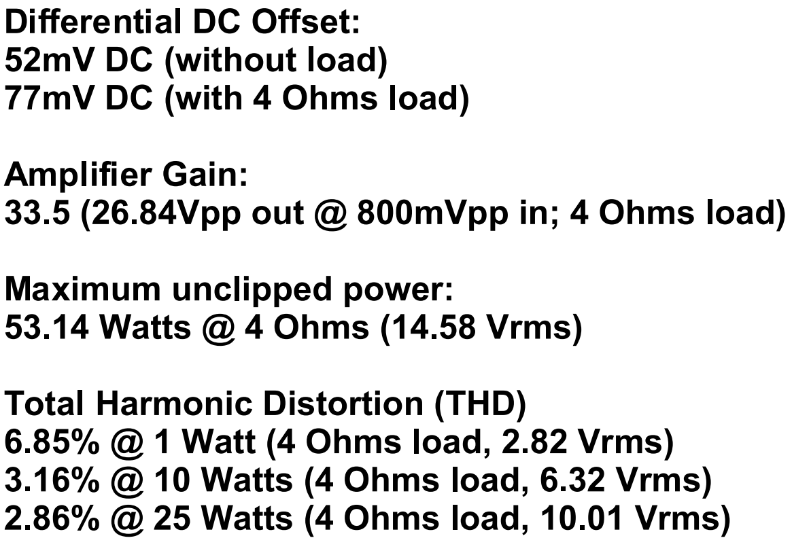

# Discrete-PWM-Class-D
This is a design of a discrete PWM closed-loop Class-D amplifier as presented in my YouTube video.

The amplifier is powered by 24V, running at 500 kHz switching frequency and is capable of deliver up to nearly 55 watts of unclipped power into a 4 ohms load.

In this GitHub repository you will find following documentation:
- Concept Drawing
- PCB Schematic, Gerber Files and BOM
- LTSpice Simulation of LC output filter
- LTSpice Small-Signal simulation of the main control-loop
- LTSpice Transient simulation of the whole amplifier
- Time-Domain oscillopscope screenshots for measuring Gain and RMS voltages during THD measurement
- Spectrum-Analyzer screenshots for THD measurements

## Measurement Results:

