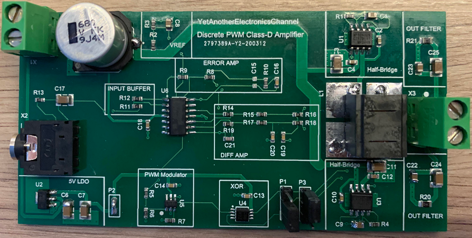

# Discrete-PWM-Class-D
This is a design of a discrete PWM closed-loop Class-D amplifier as presented in my YouTube video.

The amplifier is powered by 24V, running at 500 kHz switching frequency and is capable of delivering up to nearly 55 watts of unclipped power into a 4 ohms load. Even if the THD measurements seem to be a little bit high, the audible quality through a speaker is (at least in my opinion) on HiFi-level.

## In this GitHub repository you will find following documentation
- Concept Drawing
- PCB Schematic, Gerber Files and BOM
- LTSpice Simulation of LC output filter
- LTSpice Small-Signal simulation of the main control-loop
- LTSpice Transient simulation of the whole amplifier
- Time-Domain oscilloscope screenshots for measuring Gain and RMS voltages during THD measurement
- Spectrum-Analyzer screenshots for THD measurements

## Measurement Results
Amplifier Gain: 33.5 (26.84 Vpp out @ 800 mVpp in; 4 Ohms load)

Maximum unclipped power: 53.14 Watts @ 4 Ohms (14.58 Vrms)

Differential DC Offset: 52mV (without load), 77mV (with 4 Ohms load)

Total Harmonic Distortion (THD) @ 1 kHz  
6.85% @ 1 Watt (4 Ohms load, 2.82 Vrms)  
3.16% @ 10 Watts (4 Ohms load, 6.32 Vrms)  
2.86% @ 25 Watts (4 Ohms load, 10.01 Vrms)  

## Simulation
In case you want to simulate the amplifier yourself, LTSpice will miss the Spice-model for the OPAx197 opamp family, which is needed.
The Spice-Model can be downloaded here: http://www.ti.com/lit/zip/sboma34

## Important
Please be aware, that this amplifier doesn't have any safety-features (e.g. short-circuit, DC output, overcurrent, over-temperature etc..).
So the usage is up to your own risk, in case you consider to rebuild this amplifier.

